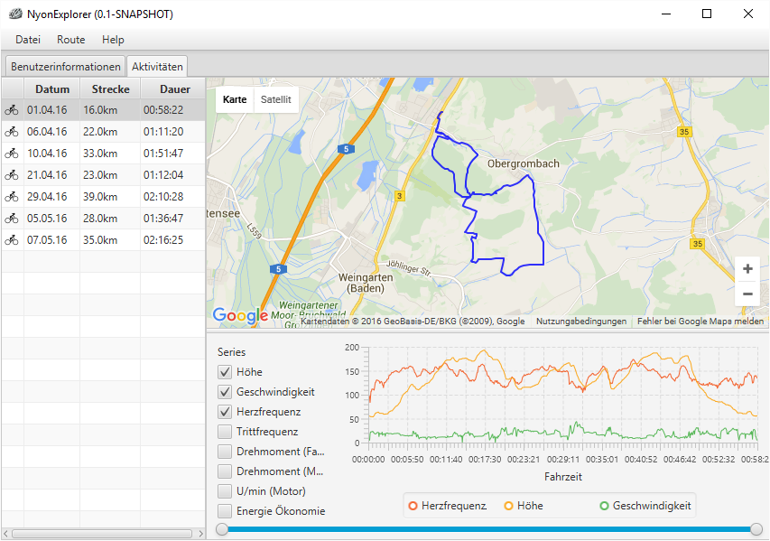

NyonExplorer - A multitool for Bosch Nyon owners.
=============================================================

NyonExplorer is an alternative frontend for Bosch Nyon owners. It uses raw data from https://www.ebike-connect.com. The application is not yet nearly feature complete - please feel free to request features.

Current features
----------------

   + Overview about all recorded activities
   + View activity track on map
   + Export activity as GPX (with Garmin Extension: Cadence, Heart-Rate)
   + Export activity as TCX (Training Center XML)
   + View activity statistics:
      + Height (m)
      + Speed (km/h)
      + Heart rate (bpm)
      + Cadence (rpm)
      + Driver torque*
      + Motor torque*
      + Motor revolutions (rpm)
      + Energy economy*

Installation
------------

Binary releases can be found here: https://github.com/cgiesche/ebikeconnect-gui/releases/latest

There are currently two versions:

**ebikeconnect-gui-VERSION.zip**
A version that needs at least Java Runtime 1.8u77 correctly installed on your System. Extract zip file and run "ebikeconnect-gui-VERSION-jfx.jar".
 
**ebikeconnect-gui-standalone-win64-VERSION.zip**
A version that brings it's own Java Runtime - but only for Windows (64 Bit) operating systems. Extract zip file and run "ebikeconnect-gui.exe".
